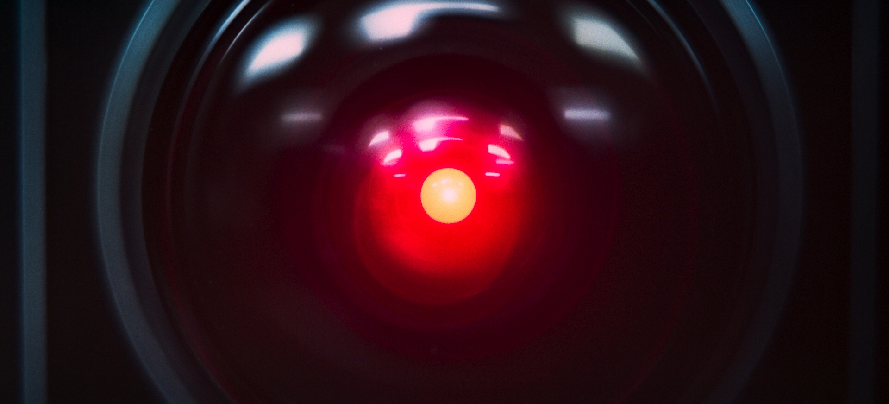

A lot of things go round in my head. Like most people I'm sure, I spend a lot of time thinking about topics and can get quite fervent about things without it actually going anywhere. While I often enjoy these mental whirlwinds of imaginative possibility, sometimes I wish I could verbalize these things, particularly if I feel those things may be something where my opinion could be a voice to add to the discussion. But conducing things into words is hard. 

For five years of my life, I was in a mad state of ultimate minimalism where I destroyed anything that wasn't directly contributing to my existence in some way. I credit this minimalist state with much good in my life - I think it is what made me much of the person I am now, but it had consequences: I threw out, burned, destroyed, or otherwise removed all manner of paperwork, art that I had done, artefacts of various events, etc. There were several reasons for this extreme minimalism, but I think the major one driving my destruction of documents was my disdain for my past self's existence. The past me was surely stupider and far more embarrassing than the current me, so there was no reason to keep these documents that crystalized a state of knowledge and negative presentation - if other people found them, it would misrepresent me. I'm not quite sure if this came from adolescent insecurities about myself, but I think there is some truth to this. I hated getting photographed for most of my childhood, and especially between ages 14 and 20 I wanted to avoid creating much evidence of my existence.

I don't think this way anymore. An exercise producing a family photo album recently was deeply fulfilling for me, and challenged my views about producing artefacts of my existence. If my grandchildren would be robbed of that opportunity because of my fear of being seen making a mistake; that would be a tragedy indeed.

I have a healthier relationship now with the idea that I am a fallible being. Perhaps fallibility is one of the things that demonstrates us as natural organic beings. HAL 2000 would certainly agree.

In my minimalist state, I refined my though process: If I was going to destroy my writings shortly after I created them, why even bother writing anything down. As a result of this, all through university and a few years either side, I never wrote anything down if I didn't need to. I took no notes. I believed that my memory would be good enough to make it to the exam, and that was all that was needed (which for a BCom at least turned out to be true). The only artefacts I have to prove I even went to university are assignments I absolutely had to write down, and my degree itself.

But now that I'm over this concept, I _can_ write again. One of the first things I wrote under this new philosophy was the first article on this site. 576i is perhaps the biggest artefact of this change in philosophy. But now I want to take it a step further.

When I write, it's a thorough process involving much research, review, corrections, and self-censorship to remove anything that may be controversial, too opiniated, or too emotional. While this is a fine way to write factual, informative articles, which I fully intend to keep doing in this manner, it doesn't work so well to just _get things down on the page_. I fear making a mistake, or writing something that could make someone angry. To avoid this, I sanitize, and that takes time and sometimes purges things of their spirit. I read lots of other blogs - and people write short, punchy, opiniated, angry content all the time. Some of the short emotional tid-bids are the most interesting, and allow me a view into the mind-state of a person I am reading. I don't blame people for this, and as such I should expect people who read this to do the same.

I think to simply create more artefacts for myself and future generations to reflect on; and understand me at that time in my life, I need to be able to accept publishing writings that are much less refined, much less edited, and much closer to the raw stream of consciousness. More than just accepting it, I want to expose more of the madness in my mind.