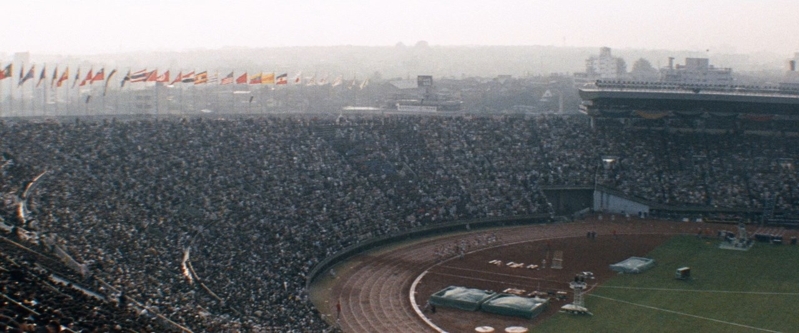
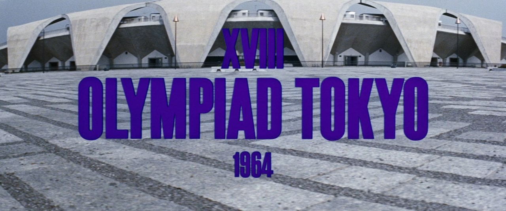
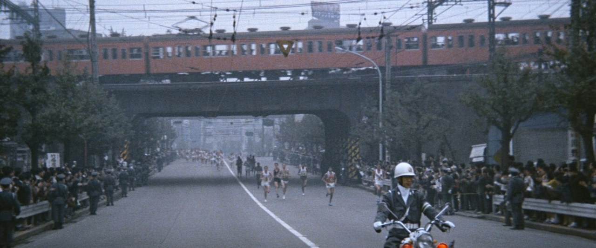

I write this on the 11th of July 2021, twelve days to the commencement of the 2020 Summer Olympics[^1], officially *Games of the XXXII Olympiad (第32回オリンピック競技大会)*. These Olympics are poised to be symbolically important for the world, as they take place on the recovery path for the COVID-19 pandemic, which has had the world in it's grips since early 2020. Of course, COVID-19 is the reason the 2020 Olympics are taking place in 2021.

Already the topic of much debate and general public dissent, the IOC and Japanese government seem steadfast in their decision to go ahead, despite the risks in a country which continuously struggles to keep COVID-19 under control. It seems almost inevitable now that the 2020 Olympics will at least *start*, but I'm making no bets on what happens from there. As of yesterday, the Japanese government [confirmed that events will be spectator-less](https://www.rnz.co.nz/news/sport/446508/olympics-tokyo-bans-spectators-amid-covid-19-emergency) in light of a re-declared state of emergency for the Tokyo Metropolitan Area. I'll be interested to see how this affects the opening and closing ceremonies, typically a display of many thousands of people of all nations.

At this point, these Olympics seem like a forced display of strength and recovery that we aren't quite ready for. It's unfortunate, as another delay would really be stretching the concept of hosting them, but none-the-less it's bizarre. It might take until the next Olympics to have the full scale sign of recovery. This is sad for Japan as some had placed this Olympics as a sign of recovery for disasters that have happened in Japan prior to the COVID-19 pandemic, primarily the 2011 Tōhoku earthquake and tsunami. In this disaster alone, nearly 20 thousand people died and caused immense economic and emotional damage. Between ourselves we can know that Japan has mostly recovered from this but sometimes it's nice to have a big ol' display like these Olympics would've been. This is something Japan has experienced before - the last Olympics Japan hosted, in 1964.

### Sometimes it doesn't work out like the first time

Following the end of World War II, Japan; and especially Tokyo were in a position of total devastation. This was the result of the immense fire-bombing campaigns by the Americans, levelling most urban areas to the ground with terrifying effectiveness, often far worse than the impacts on European cities[^2]. For the people residing in urban areas especially what followed was months to years of lack of shelter, food, and general basic needs of life. Many tens of thousands died well after the official 'end' of World War II. It would take all of the rest of the 40's and 50's to really regain any sense of 'moving forward' economically and socially. 

This began a slow rebuild and reconstruction of daily life for many citizens of Japan. Previously disallowed to host the Olympics immediately preceding World War II as a sanction for invading China, Japan's renewed global image as a unassuming peaceful nation could be marketed for the first time when offered the opportunity to host the 1964 Summer Olympics by the IOC.

The Japanese government truly bought into this scheme of using the Olympics as their first shot of re-entering the global stage. They commenced huge public works programs to construct the required stadiums, facilities, and transport infrastructure to get people there. The Shinkansen, specifically the zero or 'sen' series which gave it it's western name bullet train; ran it's first service nine days prior to the start of the Olympics on 1st October 1964[^3]. Among many constructions were the National Stadium, rebuilt for 2020; and the National Gymnasium, which will be used in it's then existing format in 2020. So much reconstruction work took place, it influenced a series of semi-anti-redevelopment artworks including the Studio Ghibli film *From Up on Poppy Hill* - which presents a story of some teenagers trying to save their old school hall from destruction in the face of the Olympics development committee. Come the second half of 1964, much of Tokyo had had some sort of adjustment.

It's clear that the Japanese government saw this event as a transitional watershed of their time, a hallmark to show how far they had come. So much so, that the all-important final runner of the Olympic flame was one Yoshinori Sakai, who was born on August 6th 1945 in Hiroshima - the day the atomic bomb was dropped there.

### For a transitional event, use transitional technology

Almost every Olympic games has been recorded in some format since some of the first editions. In 1964, the story was no different. This quote from [Fred Springer-Miller in 1965's *Popular Photography*](https://web.archive.org/web/20120718045333/http://basepath.com/Photography/SpotmaticReview.html) summs it up nicely:

> Among the records set at the Olympic games in Tokyo last fall was a new mark for the greatest assemblage of heavy photographic artillery in history. The focal lengths, if taken together, might have reached from Tokyo to the moon.

It appears to be a tradition to make a movie out of footage taken at each Olympic games. The organisers of this event wished to hire Akira Kurosawa, the greatest Japanese director at the time (and still today), but known for his incredible control, fired him when he insisted that he be given creative control over the entire opening and closing ceremonies *in addition* to creative control of making the film. With little time to go, they found a director by the name of Kon Ichikawa. Kon, who had a reputation for being able to come in at last minute and make something of it, was hired to shoot the film, and by golly did he do just that.

Kon Ichikawa's *Tokyo Olympiad* is a whopping 2 hours and 50 minutes long, and is a sporadic beast of telephoto slow-mo mastery, artistic emotional stories of victory, defeat and pain at the 1964 Olympics. Called by many the best sport documentary ever made, this film showcases what Kon saw at the Olympics, but doesn't do it in the typical glory focus on national athletes like they often do. This film has no bias on who or what is included, and all of it is interesting to watch. Ichikawa created a film which shows the Olympics in it's all - the occasional triumph, and the occasional injury w/ ambulances.

Ichikawa's film is a true work of cinema, and an innovative documentary to boot, having an impact on how documentary filmmaking would be done for years to come. It's a true stroke of luck Ichikawa did what he did. If he played it straight, we would've got just another Olympic summary film - inspiring, sure. But not innovative, intimate, and truly creative. It makes a lot of sense to me that Ichikawa would create such a transitional piece of documentary work here - as it simply matches the transitional nature of the whole event.  

The organisers that hired Ichikawa were not expecting what they got. I like this quote from James Quandt's essay *Tokyo Olympiad: The Wind Passing Through the Flagpoles*:

> Little surprise that _Tokyo Olympiad_ was rejected—in many cases, reviled—by the authorities who had commissioned the film or who, as members of the Ministry of Education, were charged with its exhibition throughout Japan. What has long since been consecrated as one of the greatest of all films about sports—or, indeed, anything else—was in its time widely denounced at home as cynical and unpatriotic (not enough Japanese athletes or celebration of postwar Tokyo and the Olympic venues) or, conversely, by leftist critics, as too nationalistic (a surfeit of Japanese flags and sun images that invoke that ensign). The worst crime of all, according to its commissioning committee and government sponsors, was that Ichikawa had created not a document of the Games but a work of bewildering artistry. When officials requested that Ichikawa reshoot the film to produce something more conventional and celebratory, the director later sardonically quipped that he “was able to reply truthfully that circumstances prevented it, as the entire cast had left Japan.”

I was sceptical going in to it that I would manage to stay interested for that long on simply athletes going about their sport. But Ichikawa somehow managed to keep this film interesting if so much in that it was nigh unpredictable what you would see next. He jumps from event to event with no rest time between shots. The opening ceremony sequence cuts so suddenly straight into a sprint that one doesn't have time to quite process what just happened; and creates a sense of excited confusion.

Scenes like the 100 meter sprints are turned into intimate emotional affairs, with languid slow motion shots and the commentator bringing doubt that the athletes are really very pleased to be there at all. In stark contrast, the men's cycle road race and walking race are comedic high paced affairs with drama and their own flare. Somehow, every single event Ichikawa turns into it's own special story. This peaks in the marathon, the final crown jewel of the Olympic events. of which five or six times as much runtime of the already immense film is devoted to compared to any one other event.

Technically speaking, the film is beautiful. Shot entirely in CinemaScope (ever so slightly wider than modern 21:9) and using state-of-the-art telephoto lenses, the visual presentation of this film is hugely cinematic feels expansive. The marathon in particular with it's epic helicopter fly-overs and wide angle whole street shots is something to behold, and a single shot under a rail-bridge complete with train running over top really shows me more than anything else this is a 'new Japan'.

A scene with a running race somehow punches in on a single runners eyes and tracks them for a huge amount of time, with incredible accuracy, assuming the camera operator was some several hundred meters away equipped with a stupidly large zoom lens. The filmstock used gives the event a certain pastely colour pallet, firmly placing it's aesthetics right in it's day.

If I had any one detractor, it's the sound work on this film. I can't really blame Ichikawa as the technology really just wasn't there yet. Oftentimes things are dubbed over with obnoxious foley created sound effects for the sake of having something there. Some events seem to have true sound, but it's never fantastic. Allegedly, the high-speed film cameras used to shoot the slow motion scenes were incredibly loud and had to be smothered with blankets - something that would affect them being able to record adequately.

### Closing Notes

If you're looking for a film to watch that presents an incredibly interesting portrayal of a transformative Olympics, go no further than this film.

I wonder if the film made for this Olmypics will be anything like what Ichikawa made. Somehow I doubt it, but we can hope. Or perhaps, something more innovative. None the less, what seems to be true is that these Olympics to come in the next few days will be symbolic for their own reasons. Let's see how it plays out.

#### Extra for Experts

1. [James Quandt's enthralling essay on this film](https://www.criterion.com/current/posts/6994-tokyo-olympiad-the-wind-passing-through-the-flagpoles)

[^1] Despite taking place in 2021, the organisers of this Olympics decided to continue to call it the '2020' Olympics.

[^2] Because of their predominantly still wooden construction methods, Japanese cities were especially susceptible to fire, and as a result fire-bombing would totally engulf entire neighbourhoods. Traditional explosives had an initial impact that then couldn't spread, limiting their impact somewhat.

[^3] The Shinkansen was not constructed exclusively for the Olympics, but it was hastened so that the core line that would be relevant to some journeys would be ready in time. Only a single line would open on 1st October 1964.